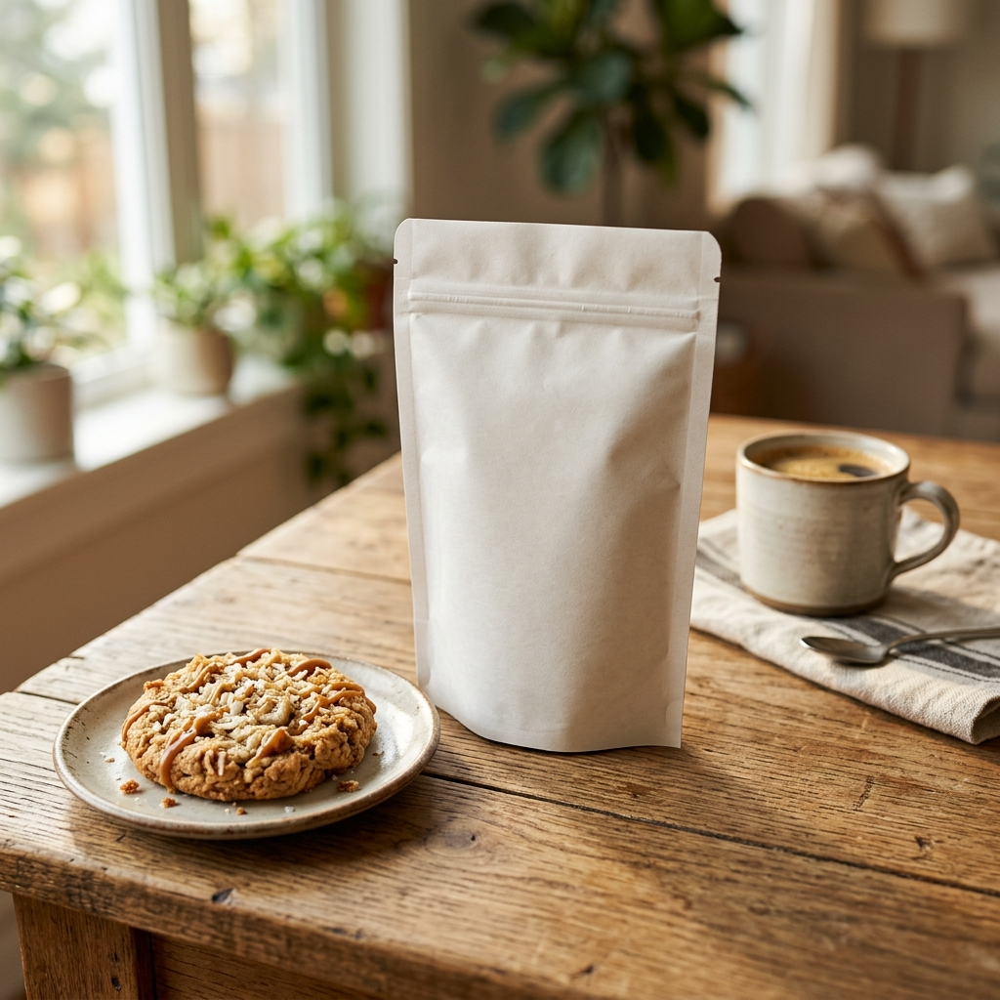

# Groupe Bimo - Campaign Strategy
**Brand:** Groupe Bimo
**Date:** 2026-05-15
**Campaign Version:** 1.0

---

# Phase 1: Benchmark Report

## Brand Audit: Groupe Bimo
Groupe Bimo is a prominent player in the FMCG sector, specializing in Biscuiterie, Chocolaterie, Gaufretterie, and the transformation of cocoa beans. With new product lines including irresistible Cookies (Banane, Coco, Caramel), the brand is looking to launch a new campaign. The client's brief specifically emphasizes the need for authentic, real-life visualization of products through photography and mockups.

## Positioning
**Essence:** Indulgent, accessible, and high-quality sweet treats for everyday enjoyment.

**Brand Pillars:**
1. **Authenticity:** Real ingredients (cacao transformation) and relatable consumption moments.
2. **Innovation:** Exciting flavor combinations like Banana-Coco-Caramel.
3. **Joy & Sharing:** Enhancing family and social moments with delicious snacks.

## Gaps & Opportunities
- **Gap:** Traditional FMCG marketing often relies on heavily stylized, artificial-looking renders or flat packaging shots. 
- **Opportunity:** The client specifically requested real-life photography and mockups. This presents an opportunity to stand out with "slice-of-life" authentic imagery that highlights texture, context, and the visceral appeal of the products.
- **Opportunity:** Highlighting the "bean-to-bar" (cocoa bean transformation) aspect visually can elevate the brand's perceived quality.

## Persona
**The Everyday Indulger (Amina & Youssef)**
- **Demographics:** 18-45 years old, active professionals, students, or parents.
- **Psychographics:** Values quality and taste but needs convenience. Looks for small moments of joy during a busy day (a coffee break, a kids' snack time). 
- **Needs:** Craves authentic, relatable visual cues that promise a delicious taste experience.

---

# Phase 2: Visual Direction

## Moodboards: Conceptual Themes
**Theme: "Authentic Indulgence"**
Focus on real-world scenarios. Sunlight streaming across a rustic wooden kitchen table, a hand breaking a cookie in half, crumbs catching the light. The mood is warm, inviting, and visceral. The integration of product mockups within these scenes is key.

## Hex & Typography
**Color Palette:**
- **Cocoa Brown:** `#3D2314` (Deep, rich, grounds the visual identity)
- **Caramel Gold:** `#D49A36` (Warm, appetizing, acts as an accent)
- **Creamy Off-White:** `#F9F6F0` (Clean, provides breathing room for vibrant products)
- **Banana Yellow:** `#F4D03F` (Playful, energetic highlight)

**Typography:**
- **Primary (Headlines):** **Outfit** (Bold) - A modern, friendly sans-serif for impactful and clean communication.
- **Secondary (Body):** **Inter** (Regular) - For maximum legibility and clean structure across print and digital.

## Style Guidelines
- **Imagery Style:** Photorealistic, "slice-of-life". Use natural lighting (golden hour or bright morning window light). Macro shots emphasizing textures (chocolate chips, waffle crunch).
- **Layout:** Clean and minimal to let the photography shine. Large hero images with bold, overlapping typography. Use subtle drop shadows for depth and integrate real-world mockups.
- **Tone:** Joyful, appetizing, authentic, and inviting.

---

# Phase 3: Media Kit

## Generated Assets
The following assets have been generated to align with the visual direction:

### 1. Lifestyle Cookie Mockup
A photorealistic representation of the product in a real-world setting, reinforcing the "Authentic Indulgence" theme.

## Asset Delivery
All final assets, including source files and exports, are available in the `results/assets/` directory.

