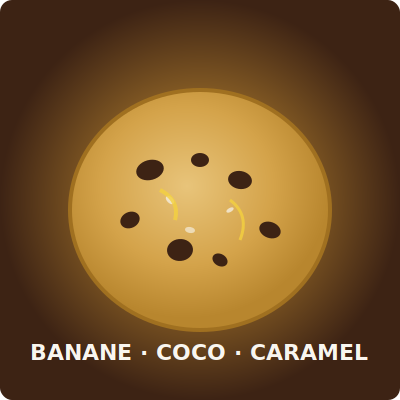
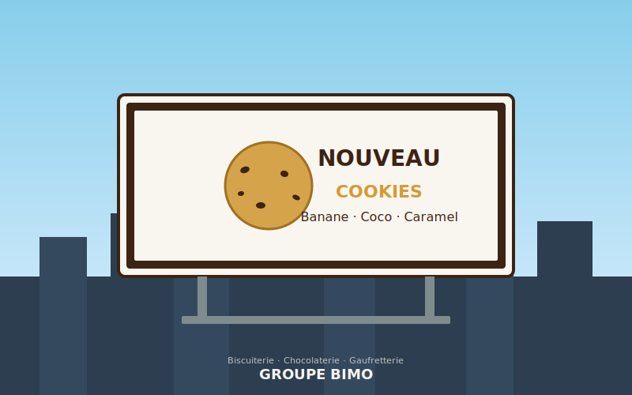
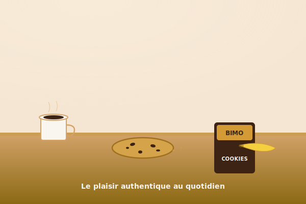

# Groupe Bimo — Campaign Strategy

**Brand:** Groupe Bimo  
**Date:** 2026-05-15  
**Campaign Version:** 1.0  

---

# Phase 1: Benchmark Report — Groupe Bimo

## Brand Audit

**Groupe Bimo** is a leading Algerian FMCG conglomerate specializing in Biscuiterie, Chocolaterie, Gaufretterie, and cocoa bean transformation. The brand portfolio includes household names like Croc Matin, Petit Bimo, Rapidôs, Goldy, Master Choc, and the new **Cookies Banane-Coco-Caramel** line.

**Market Context:** The FMCG biscuit category in North Africa is crowded with both global (Oreo, LU) and regional players. Bimo differentiates on local heritage, quality ingredients, and accessible pricing.

**Digital Presence:** A functional but dated website (groupebimo.com) with basic product listings, recipe pages, and social media links. Limited visual storytelling or lifestyle content.

**Campaign Need:** Launch photography and billboard mockups for the new Cookie line, emphasizing authentic real-life visuals over artificial renders.

## Positioning

**Essence:** *Indulgent, accessible, and high-quality sweet treats for everyday enjoyment.*

**Brand Pillars:**
1. **Authenticity:** Real ingredients (cacao transformation) and relatable consumption moments.
2. **Innovation:** Exciting flavor combinations like Banana-Coco-Caramel.
3. **Joy & Sharing:** Enhancing family and social moments with delicious snacks.

**Tone of Voice:** Warm, inviting, simple, confident.

## Gaps & Opportunities

| Gap | Opportunity |
|-----|-------------|
| Dated digital presence — no lifestyle imagery on site | Create a library of authentic photography and billboard mockups |
| Heavy reliance on flat packaging shots in existing marketing | "Slice-of-life" real-world visuals showing texture, crumbs, context |
| No visible outdoor/billboard advertising | Deliver ready-to-use billboard mockups for OOH placements |
| Weak brand storytelling around cocoa sourcing | Leverage "bean-to-bar" narrative to elevate quality perception |

## Persona

**The Everyday Indulger**
- **Name:** Amina / Youssef
- **Age:** 18–45
- **Occupation:** Student, active professional, or parent
- **Psychographics:** Values quality and taste but needs convenience. Seeks small moments of joy during busy days — a coffee break, a kids' snack time, an afternoon treat.
- **Media Habits:** Instagram, YouTube, OOH billboards during commute.
- **Needs:** Authentic visual cues that promise delicious taste. Relatable scenarios, not sterile ads.

---

# Phase 2: Visual Direction — Groupe Bimo

## Moodboards: Conceptual Themes

### Theme 1: "Authentic Indulgence" (Primary)
Real-world scenarios: sunlight streaming across a rustic wooden kitchen table, a hand breaking a banana-coco-caramel cookie in half, crumbs catching the light, steam rising from a coffee cup beside the package. The mood is warm, inviting, visceral.

### Theme 2: "Urban Snack Moment" (Billboard Focus)
Bold, high-energy outdoor scenes — a cookie held against a sunlit city skyline, a vibrant street-side café table, oversized product shot with typography overlaying the urban backdrop. Designed for OOH billboard readability from distance.

## Color Palette

| Swatch | Hex | Role |
|--------|-----|------|
| Cocoa Brown | `#3D2314` | Deep foundation — grounds the identity |
| Caramel Gold | `#D49A36` | Warm accent — appetizing, premium feel |
| Creamy Off-White | `#F9F6F0` | Background — clean, airy, lets products breathe |
| Banana Yellow | `#F4D03F` | Energetic highlight — playful, youthful |
| Fresh Mint | `#A3D9A5` | Secondary accent — freshness, natural ingredients |

## Typography

| Usage | Font | Weight |
|-------|------|--------|
| Headlines / Billboard Copy | **Outfit** | Bold (700) |
| Subheadings | **Outfit** | SemiBold (600) |
| Body Copy | **Inter** | Regular (400) |
| Accent / Data | **Inter** | Medium (500) |

## Style Guidelines

### Imagery
- **Style:** Photorealistic, "slice-of-life"
- **Lighting:** Natural — golden hour or bright morning window light
- **Composition:** Macro shots emphasizing textures (chocolate chips, caramel drizzle, coconut flakes)
- **Billboard variant:** High-contrast, bold product hero with minimal background blur, large readable typography

### Layout
- Clean, minimal — let the photography lead
- Billboard: centered product + headline, brand logo bottom-right
- Digital: large hero images with bold overlapping typography
- Drop shadows for depth on packaging mockups

### Tone
- Joyful, appetizing, authentic, inviting
- Warm but not sentimental — confident and modern

---

# Phase 3: Media Kit — Groupe Bimo

## Overview
This media kit contains all generated visual assets for the Groupe Bimo Cookie Campaign, aligned with the "Authentic Indulgence" and "Urban Snack Moment" creative directions.

## Generated Assets

### 1. Cookie Product Hero

Primary hero visual: a photorealistic banana-coco-caramel cookie on a warm brown background. For use in digital, print, and as a base for billboard layouts.

### 2. Billboard Mockup

Out-of-home billboard visualization featuring the cookie product against a city skyline. Headline: "Nouveau Cookies Banane · Coco · Caramel". Ready for client pitch decks.

### 3. Lifestyle Tableau

"Slice-of-life" still-life composition: cookie on a wooden table beside coffee, banana, and packaging. Warm sunlight reinforces the authentic indulgence theme.

## Asset Delivery
All final assets are available in the `results/assets/` directory alongside a `manifest.json` containing metadata (filename, alt text, purpose) for every generated file.

## Usage Guidelines
- Maintain color consistency: use Cocoa Brown (#3D2314), Caramel Gold (#D49A36), and Banana Yellow (#F4D03F) as primary palette.
- Typography: Outfit for headlines, Inter for body copy.
- For print, use the SVG assets at native resolution. For digital, downscale as needed.

---

