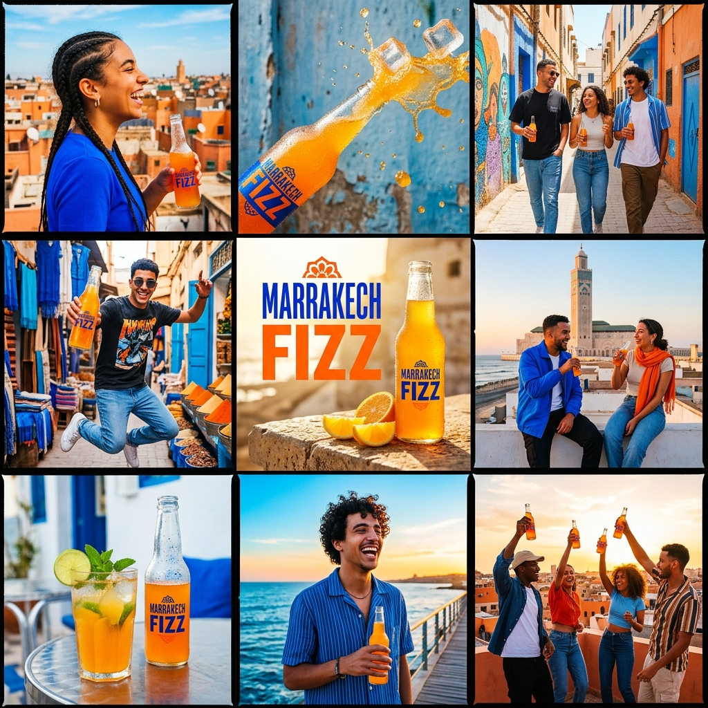

# Media Kit

> Final generated assets for the ICE campaign based on the visual direction.

---

## 1. Visual Identity Recap
- **Colors:** Vibrant Orange (`#FF6B00`), ICE Blue (`#0055FF`), Crisp Lime (`#A8E000`)
- **Typography:** `Outfit` (Headings) / `Inter` (Body)
- **Theme:** "Urban Moroccan Vibrance" - Celebrating local youth culture.

---

## 2. Static Assets

### Key Visual / Moodboard
**File:** `assets/ice_brand_moodboard.png`
**Usage:** Social media reference, internal vision setting.
**Format:** Square (1:1), PNG.

---

## 3. Video Assets

### Social Media Reel: "Notre Saveur, Notre Vibe"
**File:** `assets/campaign-ad.mp4`
**Usage:** Instagram Reels, TikTok, YouTube Shorts.
**Format:** Vertical (9:16), MP4, 30fps.
**Duration:** 5 Seconds (150 Frames).
**Description:** High-energy motion graphic combining the urban vibrance moodboard with the core brand slogan. Uses dynamic spring animations for the logo and smooth interpolations for text layers.

*(Video embedded below — please open `index.html` in browser to view)*

---

## 4. Usage Instructions
1. **Instagram/TikTok:** Post the vertical `campaign-ad.mp4` directly.
2. **Post Copy:** "La fraîcheur 100% marocaine. 🇲🇦 Quelle est ta saveur ICE préférée ? #IceMaroc #NotreSaveurNotreVibe"
3. **Sound:** Recommend overlaying with trending upbeat Moroccan rap/pop audio natively on the platform.
